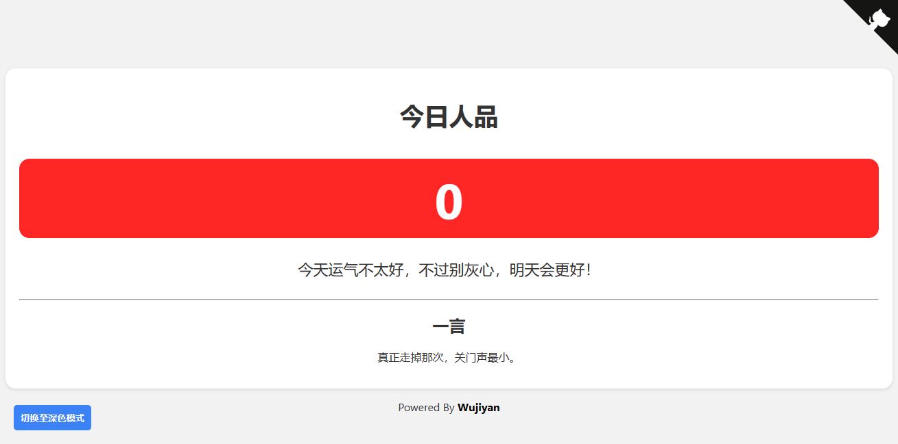
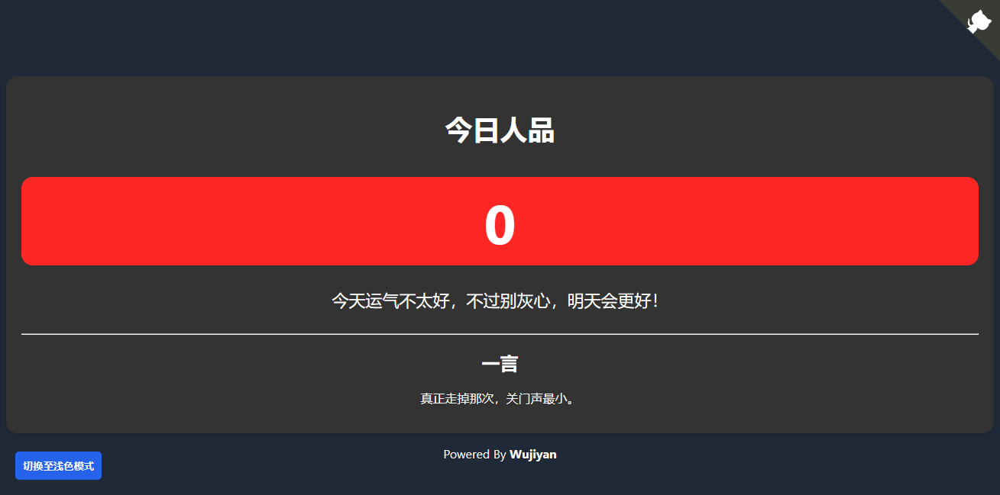

# jrrp-web  今日人品
[English Readme](./README_EN.md)
## 简介
一个用html5写成的简易的web页面，显示用户今日人品值
使用了js+localStore本地储存，每天会重新随机计算用户的人品值，并伴随日期一起储存
在线体验[https://jrrp.wujiyan.cc/](https://jrrp.wujiyan.cc/)
## 调用API
目前只在jrrp目录的index.html中调用了一言api[https://hitokoto.cn/](https://hitokoto.cn/)
## 目录结构
```
│  favicon.ico
│  index.html
│─css
│      loader.css
│      main.css
│      style.css
├─img
│      jrrp-dark.png
│      jrrp-light.png
│      main-dark.png
│      main-light.png
├─jrrp
│      index.html
└─js
        dark-mode.js
        script.js
```
## 截图




